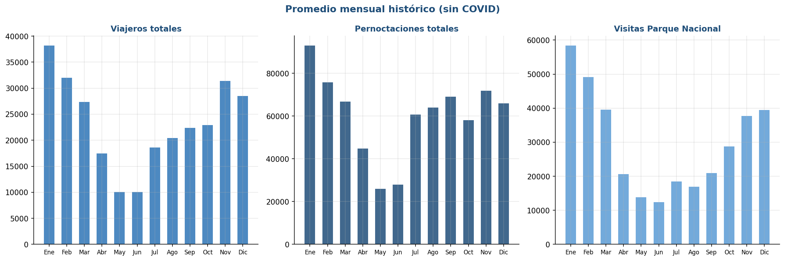
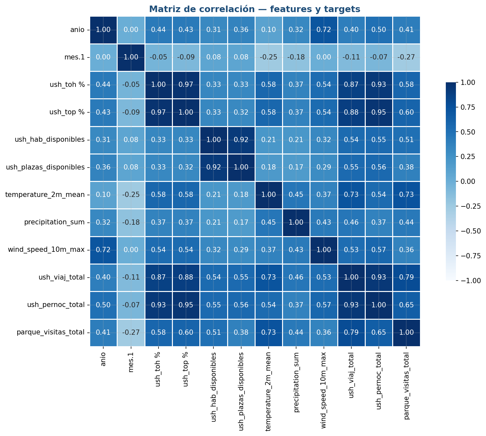
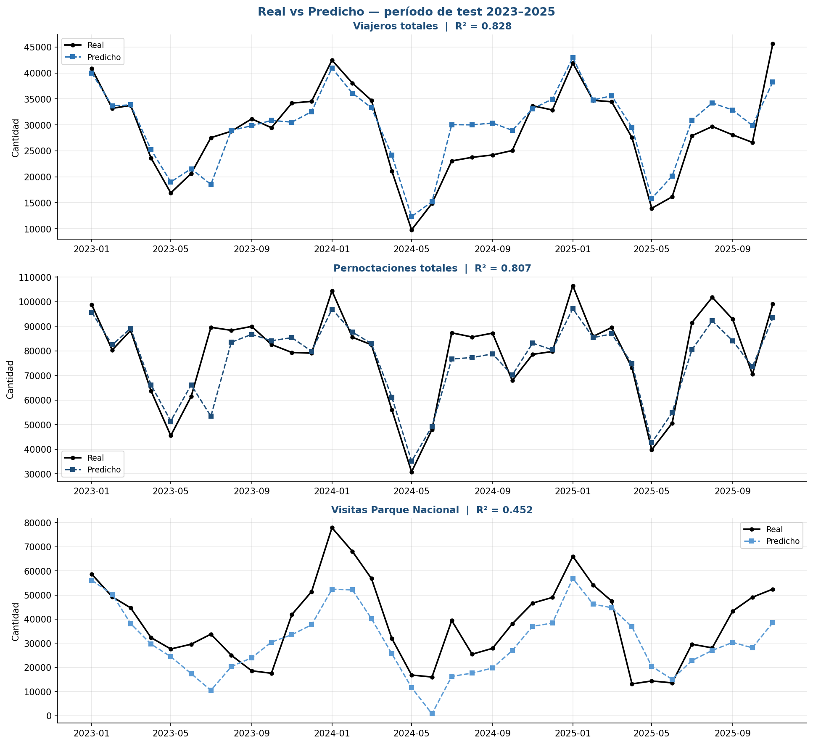

<div align="center">


<br/>

# 🏔️ Predicción de Demanda Turística — Tierra del Fuego

**Modelo de aprendizaje automático para predecir la demanda turística mensual de Ushuaia, Tierra del Fuego (Argentina) —viajeros totales, pernoctaciones y visitas al Parque Nacional—, utilizando series temporales históricas enriquecidas con variables climáticas y de oferta hotelera.**

<br/>


</div>

---

## 📑 Tabla de Contenidos

- [📖 Descripción del proyecto](#-descripción-del-proyecto)
- [📂 Estructura del repositorio](#-estructura-del-repositorio)
- [📊 Dataset](#-dataset)
  - [Grupos de variables](#grupos-de-variables)
  - [Features seleccionadas](#features-seleccionadas-para-el-modelo)
- [⚙️ Requisitos e instalación](#️-requisitos-e-instalación)
- [🚀 Uso](#-uso)
- [📈 Resultados](#-resultados)
- [🧪 Notas metodológicas](#-notas-metodológicas)
- [📚 Referencias](#-referencias)
- [✍️ Autoría](#️-autoría)

---

## 📖 Descripción del proyecto

El turismo es uno de los principales motores económicos de Ushuaia y la provincia de Tierra del Fuego. La marcada estacionalidad de la región —con picos en el verano austral (enero–febrero) y valles profundos en invierno (mayo–junio)— genera incertidumbre operativa tanto para el sector público como el privado.

Este proyecto construye un **modelo predictivo** capaz de anticipar la demanda turística mensual con un **horizonte de 3 a 6 meses**, apoyando decisiones en hotelería, transporte, gastronomía e infraestructura.

> 🎯 **Objetivo:** estimar tres variables objetivo mensuales —`ush_viaj_total` (viajeros totales), `ush_pernoc_total` (pernoctaciones totales) y `parque_visitas_total` (visitas al Parque Nacional Tierra del Fuego)— a partir de variables históricas, climáticas y de oferta hotelera. Se entrena **un modelo de Regresión Lineal Múltiple por cada target**, con su propio conjunto de features seleccionadas (Correlación + VIF).

---

## 📂 Estructura del repositorio

```
.
├── data/
│   ├── raw/                # Datos originales sin modificar
│   ├── interim/            # Datos intermedios en procesamiento
│   └── processed/          # Datos limpios y preprocesados
├── docs/                   # Informes del proyecto.
├── models/                 # Modelos entrenados (.pkl, .h5, .joblib)
├── notebooks/		    # Jupyter Notebooks de exploración y análisis (EDA)
├── reports		    # Imágenes y gráficos del proyecto.
├── video             	    # Video Presentación del proyecto
├── src/                    # Código fuente (entrenamiento y predicción)
├── requirements.txt        # Dependencias del proyecto
└── README.md
```

---

## 📊 Dataset

| Característica | Detalle |
|---|---|
| **Período cubierto** | Enero 2004 – Noviembre 2025 |
| **Instancias** | 263 registros mensuales |
| **Variables** | 83 columnas (7 grupos temáticos) |
| **Variables objetivo (3)** | `ush_viaj_total` (viajeros) · `ush_pernoc_total` (pernoctaciones) · `parque_visitas_total` (visitas al Parque Nacional) |
| **Fuente principal** | [IPIEC – Instituto Provincial de Estadística y Censos, TDF](https://ipiec.tierradelfuego.gob.ar/) |
| **Fuente climática** | [Open-Meteo API (ERA5 reanalysis)](https://open-meteo.com/en/docs/historical-weather-api) |

### Grupos de variables

| Grupo | Variables | Cobertura |
|-------|-----------|-----------|
| 📅 Temporales | fecha, año, mes | 100% |
| 🧳 Viajeros y pernoctaciones | totales, residentes, no residentes | 100% |
| 🛏️ Estadía promedio | noches promedio por viajero | 100% |
| 🏨 Hotelería y alojamiento | establecimientos, plazas, tasas de ocupación | 79% |
| 🌲 Parque Nacional TDF | visitas totales y por origen | 50% |
| 🚢 Cruceros | recaladas, cruceristas por tipo | 9% |
| 🌦️ Clima | temperatura, precipitación, viento | 100% |

### Features seleccionadas para el modelo

```python
mes_num, anio, temperature_2m_mean, precipitation_sum,
wind_speed_10m_max, ush_toh_pct, ush_top_pct, ush_plazas_disponibles
```

---

## ⚙️ Requisitos e instalación

**Requisitos**

- Python `>= 3.9`
- pandas · numpy · scikit-learn
- matplotlib · seaborn · openpyxl

**Instalación**

```bash
git clone https://github.com/tuusuario/turismo-tdf-ml
cd turismo-tdf-ml
pip install -r requirements.txt
```

---

## 🚀 Uso

```bash
# Análisis exploratorio
jupyter notebook notebooks/exploracion.ipynb

# Entrenamiento del modelo
python src/modelo.py
```

---

## 📈 Resultados

### Análisis exploratorio

La serie muestra una **fuerte estacionalidad anual**, con máximos en verano y mínimos en invierno.

<div align="center">
  
  <br/>
  <em>Figura 1 — Evolución mensual de viajeros, pernoctaciones y visitas al Parque Nacional (2004–2025). El período COVID-19 (mar 2020 – jun 2021) se destaca en rojo.</em>
</div>

<br/>

<div align="center">
  
  <br/><em>Figura 2 — Matriz de correlación entre predictores y las tres variables objetivo.</em>
</div>
### Desempeño del modelo

Regresión Lineal Múltiple, un modelo por variable objetivo, evaluado sobre el conjunto de prueba (2023–2025).

| Variable objetivo | R² (test) | R² CV | RMSE | MAE |
|-------------------|:---------:|:-----:|:----:|:---:|
| `ush_viaj_total` (Viajeros totales) | **0,828** | 0,874 | 3.480 | 2.669 |
| `ush_pernoc_total` (Pernoctaciones) | 0,807 | 0,903 | 8.114 | 5.337 |
| `parque_visitas_total` (Parque Nacional) | 0,452 | 0,241 | 12.308 | 10.239 |

> ℹ️ **Viajeros totales** es el modelo de mejor desempeño (explica ~83% de la variación). **Parque Nacional** es el más débil, condicionado por la menor cantidad de datos disponibles (desde 2015).

<div align="center">
  
  <br/><em>Figura 3 — Predicción del modelo frente a los valores reales en el test (2023–2025): viajeros (R² 0,83), pernoctaciones (R² 0,81) y Parque Nacional (R² 0,45).</em>
</div>

---

## 🧪 Notas metodológicas

- 🦠 El período **2020–2021** presenta valores atípicos extremos por COVID-19. Se evalúa el uso de una variable *dummy* o la exclusión del período para el entrenamiento.
- 📉 Se utilizan únicamente variables con **≥ 79% de cobertura** para el modelo principal. Las variables con alta ausencia (cruceros, desagregado por origen) quedan reservadas para análisis exploratorio.
- 🔒 **No se realizaron imputaciones** sobre las variables originales del IPIEC para preservar la integridad de los datos.
- ⏳ La división **train/test es temporal** (entrenamiento hasta 2022, prueba 2023–2025), respetando el orden cronológico propio de las series de tiempo.

---

## 📚 Referencias

- [IPIEC – Tierra del Fuego](https://ipiec.tierradelfuego.gob.ar/)
- [Open-Meteo Historical Weather API](https://open-meteo.com/en/docs/historical-weather-api)
- [ERA5 Reanalysis – ECMWF / Copernicus](https://cds.climate.copernicus.eu/)
- [datos.gob.ar – Portal Nacional de Datos Abiertos](https://datos.gob.ar/)

---

## ✍️ Autoría

Proyecto desarrollado para la materia **Aprendizaje Automático** — Politecnico Malvinas Argentinas, 2026.

<div align="center">
<br/>
<sub>🏔️ Hecho en el fin del mundo · Ushuaia, Tierra del Fuego 🇦🇷</sub>
</div>
