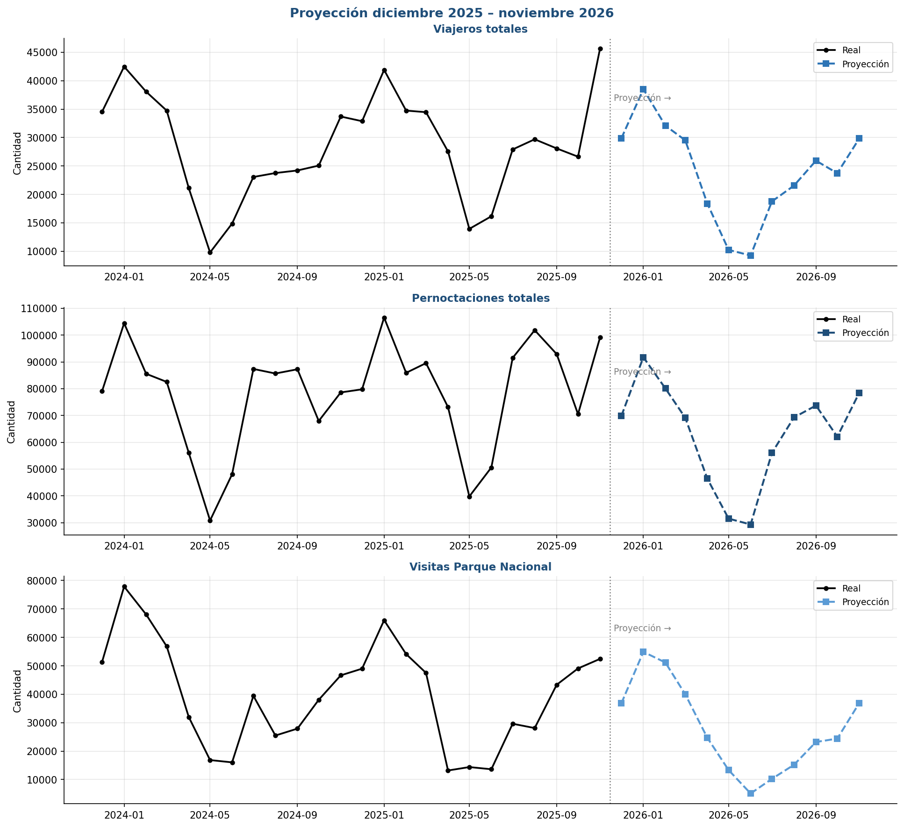

<div align="center">


# Predicción de la Demanda Turística en Ushuaia — Tierra del Fuego

### Informe Final · Mediante Modelos de Aprendizaje Automático

**Materia:** Aprendizaje Automático · **Profesor:** Nicolás Caballero
**Centro Politécnico Superior Malvinas Argentinas** · 2026
**Autor:** Darío Martínez

</div>

---

## Resumen ejecutivo

El turismo es uno de los principales motores económicos de Ushuaia y la provincia de Tierra del Fuego, con una demanda marcadamente estacional que genera incertidumbre operativa en hotelería, transporte e infraestructura. Este proyecto desarrolla modelos de **Regresión Lineal Múltiple** para predecir la demanda turística mensual sobre **tres variables objetivo**: viajeros totales, pernoctaciones totales y visitas al Parque Nacional Tierra del Fuego.

A partir de una serie temporal mensual de 2004 a 2025 (263 registros) que integra datos del IPIEC y variables climáticas de Open-Meteo (reanálisis ERA5), se entrenó un modelo independiente por cada objetivo. El de **viajeros** obtuvo el mejor desempeño (R² = 0,828 en test), seguido por **pernoctaciones** (R² = 0,807); el de **Parque Nacional** resultó más débil (R² = 0,452), condicionado por la menor cantidad de datos disponibles. Con los modelos se construyó una proyección de demanda para diciembre 2025 – noviembre 2026 que reproduce correctamente los patrones estacionales históricos.

---

## 1 · Introducción y contexto

El turismo es un motor económico fundamental de Ushuaia, polo de turismo internacional y puerta de entrada a la Antártida. El impacto de la afluencia de visitantes se derrama directamente sobre la hotelería, gastronomía, transporte local, agencias de excursiones y comercio minorista.

La demanda turística regional presenta alta volatilidad y estacionalidad, influida por factores geográficos, climáticos (temporadas de nieve), conectividad aérea y turismo de cruceros. Esta predictibilidad limitada genera ineficiencias tanto en el sector público como en el privado:

- **Sector privado:** dificultad para dimensionar personal, prever compras de insumos o gestionar tarifas dinámicas.
- **Sector público:** desafíos para planificar infraestructura, gestionar saturación de áreas protegidas y coordinar contingencias.

El uso de técnicas de Aprendizaje Automático permite procesar datos históricos multifactoriales, identificar patrones y transformar los registros estadísticos en herramientas predictivas de valor estratégico para la planificación.

---

## 2 · Objetivos y tipo de problema

### Objetivo general

Desarrollar y validar modelos de Aprendizaje Automático que predigan la demanda turística mensual de Ushuaia, con un horizonte de planificación de 6 a 12 meses, sobre tres variables objetivo.

### Objetivos específicos

- **Recolección e integración:** consolidar una base de datos unificada a partir de registros oficiales de turismo (IPIEC) y datos climáticos (Open-Meteo).
- **Análisis exploratorio (EDA):** identificar tendencias, estacionalidad, correlaciones y valores atípicos en el comportamiento histórico del turismo.
- **Ingeniería y selección de variables:** limpiar e imputar datos, y seleccionar las features relevantes mediante correlación y análisis de multicolinealidad (VIF).
- **Entrenamiento de modelos:** entrenar un modelo de Regresión Lineal Múltiple por cada variable objetivo.
- **Evaluación y proyección:** medir el desempeño con métricas rigurosas (MAE, RMSE, R², R² CV) y proyectar la demanda de los próximos 12 meses.

### Tipo de problema

El proyecto se define como un problema de **Aprendizaje Supervisado de Regresión**, ya que las tres variables objetivo son cuantitativas continuas:

1. **Viajeros totales** (`ush_viaj_total`)
2. **Pernoctaciones totales** (`ush_pernoc_total`)
3. **Visitas al Parque Nacional** (`parque_visitas_total`)

Se entrena un modelo independiente por cada objetivo, cada uno con su propio conjunto de features seleccionadas.

---

## 3 · Dataset y fuentes

| Característica | Valor |
|---|---|
| Período cubierto | Enero 2004 – Noviembre 2025 |
| Instancias (filas) | 263 registros mensuales |
| Características (columnas) | 83 variables |
| Granularidad | Mensual |
| Variables objetivo | 3 (viajeros, pernoctaciones, Parque Nacional) |
| Fuente principal | IPIEC – Instituto Provincial de Estadística y Censos, TDF |
| Fuente climática | Open-Meteo API (reanálisis ERA5 / ECMWF) |

**Origen de los datos:**

- **IPIEC:** estadísticas mensuales del sector turístico de Ushuaia, incluyendo la Encuesta de Ocupación Hotelera (EOH) y el movimiento de pasajeros. Acceso: https://ipiec.tierradelfuego.gob.ar/
- **Open-Meteo (ERA5):** valores climáticos mensuales para las coordenadas de Ushuaia —temperatura media (°C), precipitación acumulada (mm) y velocidad máxima del viento (km/h)—. Acceso: https://open-meteo.com/en/docs/historical-weather-api

Ambas fuentes se combinaron sobre la clave temporal `fecha` (año-mes) en un único archivo `dataset_turismo_clima.xlsx`.

---

## 4 · Análisis exploratorio (EDA)

El turismo de Ushuaia no es parejo: sube y baja con fuerza según la época. Conocer ese ritmo es la base del modelo.

<div align="center">
  
  <br/>
  <em>Evolución mensual de viajeros, pernoctaciones y visitas al Parque Nacional (2004–2025). El bajón de 2020–2021 corresponde a la pandemia, tras la cual la demanda se recuperó y superó los niveles previos.</em>
</div>

<br/>

Conclusiones del EDA:

- Las tres series muestran **tendencia creciente** desde 2004 con estacionalidad marcada.
- **Dos temporadas altas:** verano austral (enero–febrero) por turismo internacional e invierno (julio–agosto) por turismo de nieve. El valle más profundo ocurre en mayo–junio.
- Las **visitas al Parque Nacional** siguen un patrón principalmente estival.
- Tras el COVID, **el turismo se recuperó y superó los niveles previos a 2020**.
- Los valores extremos detectados (método IQR) no son errores sino picos legítimos de temporada alta; al tratarse de una serie temporal, se conservan para no destruir la señal estacional.

| Temporada | Meses | Característica |
|---|---|---|
| 🔺 **Alta — Verano** | Enero–Febrero | Pico del año, turismo internacional y cruceros antárticos |
| 🔺 **Alta — Invierno** | Julio–Agosto | Repunte por turismo de nieve |
| 🔻 **Baja — Otoño** | Mayo–Junio | El valle más profundo del año |
| ◾ **Transición** | Sep–Noviembre | Recuperación sostenida hacia el verano |

---

## 5 · Metodología

Esta sección describe **qué hace cada parte del código y por qué**.

### 5.1 Preprocesamiento

Tres pasos preparan los datos antes de modelar: se imputan los nulos hoteleros con la mediana del mismo mes (para no romper la estacionalidad), se excluye el período COVID por atípico, y se divide en train/test respetando el orden temporal (nunca se entrena con datos del futuro).

```python
# 1. Imputar nulos hoteleros con la mediana del mismo mes
cols_hotel = ['ush_toh %', 'ush_top %',
              'ush_hab_disponibles', 'ush_plazas_disponibles']
for col in cols_hotel:
    df[col] = df.groupby('mes.1')[col].transform(lambda x: x.fillna(x.median()))

# 2. Excluir período COVID (marzo 2020 - junio 2021) -> quedan 247 registros
mask_covid = (df['fecha'] >= '2020-03-01') & (df['fecha'] <= '2021-06-01')
df_modelo  = df[~mask_covid].copy()

# 3. Split temporal: train hasta 2022 (212 meses) / test desde 2023 (35 meses)
df_train = df_modelo[df_modelo['anio'] <= 2022]
df_test  = df_modelo[df_modelo['anio'] >= 2023]
```

### 5.2 Selección de variables (Correlación + VIF iterativo)

La selección ocurre en dos pasos por cada target. Primero se descartan las features con correlación absoluta con el target inferior a 0,10. Después se ataca la **multicolinealidad**: variables que se explican entre sí (como las dos tasas de ocupación, que correlacionan 0,97) inflan los coeficientes y los vuelven poco fiables. El VIF iterativo elimina de a una la variable más redundante hasta que todas quedan por debajo del umbral.

<div align="center">
  
  <br/>
  <em>Correlación entre features y targets. La fuerte correlación entre <code>ush_toh %</code> y <code>ush_top %</code> (0,97) es la que motiva la eliminación por VIF.</em>
</div>

```python
def vif_iterativo(df_t, feats, umbral):
    """Elimina de a UNA la variable con mayor VIF y recalcula,
    hasta que todas queden por debajo del umbral. Se calcula sobre
    variables estandarizadas para que la escala no infle el resultado."""
    feats = list(feats)
    while len(feats) > 1:
        X = StandardScaler().fit_transform(df_t[feats].values.astype(float))
        vifs = [variance_inflation_factor(X, i) for i in range(len(feats))]
        if max(vifs) > umbral:          # si hay multicolinealidad...
            feats.pop(int(np.argmax(vifs)))   # ...elimina la peor y reintenta
        else:
            break
    return feats
```

### 5.3 Modelo y entrenamiento

Se entrena una **Regresión Lineal Múltiple** por cada target (mínimos cuadrados, sin hiperparámetros). Se evaluó SVR como comparación, pero se confirmó que la relación es predominantemente lineal, por lo que se optó por la regresión por su buen desempeño e **interpretabilidad**. El punto clave es el **escalado**: el `StandardScaler` se ajusta **solo con los datos de entrenamiento** y luego se aplica al test, para evitar la *fuga de información*.

```python
for col_target, label in TARGETS.items():
    FEATURES = features_seleccionadas[col_target]   # features propias del target
    df_t = df_modelo.dropna(subset=[col_target] + FEATURES)

    X_train = df_t[df_t['anio'] <= 2022][FEATURES].values
    X_test  = df_t[df_t['anio'] >= 2023][FEATURES].values
    y_train = df_t[df_t['anio'] <= 2022][col_target].values
    y_test  = df_t[df_t['anio'] >= 2023][col_target].values

    scaler = StandardScaler()
    X_train_scaled = scaler.fit_transform(X_train)   # fit SOLO en train
    X_test_scaled  = scaler.transform(X_test)        # test solo se transforma

    modelo = LinearRegression().fit(X_train_scaled, y_train)
    y_pred = modelo.predict(X_test_scaled)

    # Métricas de evaluación
    mae  = mean_absolute_error(y_test, y_pred)
    rmse = np.sqrt(mean_squared_error(y_test, y_pred))
    r2   = r2_score(y_test, y_pred)
    r2cv = cross_val_score(modelo, X_train_scaled, y_train, cv=5, scoring='r2').mean()
```

La forma general del modelo es:

```
ŷ = β₀ + β₁·año + β₂·mes + β₃·ocupación + β₄·temperatura + … + ε
```

---

## 6 · Resultados

Métricas sobre el conjunto de prueba (2023–2025), un modelo por variable objetivo:

| Variable objetivo | R² (test) | R² CV | RMSE | MAE |
|-------------------|:---------:|:-----:|:----:|:---:|
| **Viajeros totales** | **0,828** | 0,874 | 3.480 | 2.669 |
| **Pernoctaciones totales** | 0,807 | 0,903 | 8.114 | 5.337 |
| **Visitas Parque Nacional** | 0,452 | 0,241 | 12.308 | 10.239 |

- **Viajeros totales** es el mejor modelo: explica ~83% de la variación, con un error promedio de unos 2.700 viajeros/mes.
- **Pernoctaciones** muestra buen ajuste (~81%), con un R² CV alto (0,903) que confirma su estabilidad.
- **Parque Nacional** es el más débil (R² = 0,452) y su R² CV bajo (0,241) refleja la menor cantidad de datos disponibles (desde 2015).

<div align="center">
  
  <br/>
  <em>Predicción del modelo (línea de color) frente a los valores reales (línea negra) en el período de test. Cuanto más se pegan las líneas, mejor el ajuste.</em>
</div>

<br/>

**Importancia de variables** (coeficientes sobre variables estandarizadas, comparables entre sí):

- **`ush_top %`** (ocupación de plazas): predictor dominante en viajeros y pernoctaciones.
- **`temperature_2m_mean`**: peso alto en el Parque Nacional y relevante en viajeros — a mayor temperatura, más turistas.
- **`anio`** captura la tendencia de crecimiento y **`mes.1`** la estacionalidad.

---

## 7 · Proyección diciembre 2025 – noviembre 2026

Para construir las features futuras se utilizó la **mediana histórica de cada mes** (sin COVID) en las variables hoteleras y climáticas, actualizando únicamente `anio` y `mes.1`. Representa un **escenario base sin shocks externos**.

<div align="center">
  
  <br/>
  <em>Proyección Dic 2025 – Nov 2026 (en color) a continuación de los datos reales (en negro).</em>
</div>

<br/>

| Mes | Viajeros | Pernoctaciones | Parque Nacional |
|---|---:|---:|---:|
| Dic 2025 | 29.850 | 69.811 | 36.803 |
| Ene 2026 | 38.498 | 91.738 | 54.915 |
| Feb 2026 | 32.095 | 80.104 | 51.164 |
| Mar 2026 | 29.517 | 69.149 | 39.968 |
| Abr 2026 | 18.401 | 46.464 | 24.711 |
| May 2026 | 10.237 | 31.522 | 13.338 |
| Jun 2026 | 9.258 | 29.335 | 5.098 |
| Jul 2026 | 18.767 | 56.043 | 10.252 |
| Ago 2026 | 21.541 | 69.271 | 15.184 |
| Sep 2026 | 25.932 | 73.717 | 23.209 |
| Oct 2026 | 23.725 | 62.079 | 24.400 |
| Nov 2026 | 29.843 | 78.499 | 36.937 |

La proyección reproduce los patrones estacionales históricos: picos en verano (enero–febrero) e invierno (julio–agosto) y valle en mayo–junio. Son estimaciones orientativas para apoyar la planificación, no una predicción exacta; los valores se acotan a un mínimo de cero.

---

## 8 · Conclusiones

- Los modelos de Regresión Lineal Múltiple resultaron herramientas efectivas para predecir la demanda turística de Ushuaia, especialmente en **viajeros (R² 0,83)** y **pernoctaciones (R² 0,81)**.
- Su principal fortaleza es la **interpretabilidad**: los coeficientes permiten identificar cómo influye cada variable sobre la demanda.
- El modelo del **Parque Nacional (R² 0,45)** es más débil por la menor cantidad de datos disponibles desde 2015.
- La metodología (selección Correlación + VIF, split temporal, exclusión COVID, escalado solo en train) garantiza la validez de la evaluación y la ausencia de fuga de información.

---

## 9 · Limitaciones y líneas futuras

- **Transformación logarítmica del target** para atenuar la leve heterocedasticidad observada en los residuos.
- **Incorporar lags temporales** (demanda del mes anterior o del mismo mes del año previo) como nuevas features de la regresión.
- **Ampliar la base de datos del Parque Nacional** para mejorar su modelo.
- **Incorporar variables de shocks externos** (tipo de cambio, eventos) que impacten sobre la actividad turística.

Organismos como el IPIEC o la Secretaría de Turismo podrían utilizar este tipo de modelos para apoyar procesos de planificación y monitoreo basados en evidencia.

---

## 10 · Reproducibilidad y referencias

**Archivos del proyecto:**

- Notebook principal: `01_prediccion_demanda_turistica_v2.ipynb`
- Descarga de clima: `00_descarga_clima_openmeteo.ipynb`
- Dataset integrado: `data/processed/dataset_turismo_clima.xlsx`
- Gráficos completos: carpeta `reports/`
- Repositorio: https://github.com/Gasparlorenzo/Prediccion-Demanda-Turistica-TDF2026

**Referencias:**

- IPIEC – Instituto Provincial de Estadística y Censos de Tierra del Fuego: https://ipiec.tierradelfuego.gob.ar/
- Open-Meteo Historical Weather API: https://open-meteo.com/en/docs/historical-weather-api
- Copernicus Climate Change Service / ECMWF — ERA5 Reanalysis: https://cds.climate.copernicus.eu/
- datos.gob.ar — Portal Nacional de Datos Abiertos: https://datos.gob.ar/

---

<div align="center">
<sub>

**Predicción de Demanda Turística · Tierra del Fuego** · Aprendizaje Automático 2026
Darío Martínez · Centro Politécnico Superior Malvinas Argentinas

🏔️ Hecho en el fin del mundo · Ushuaia, Tierra del Fuego 🇦🇷

</sub>
</div>
